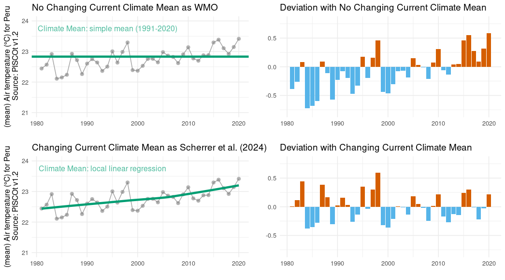

# CCM_changing_climate
Estimating the current climate mean in a changing climate

## Context
Estimating the current climate mean (CCM) is a core task of climate monitoring and an important climate service. It is used to classify climate anomalies and to determine change signals. A prominent application is the definition of the time at which the global 1.5 or 2 °C target is reached. It is traditionally determined using averages computed over 30 consecutive years, so called climate normals. Another important metric are temporal temperature trends, often expressed linearly in °C per century. However, intensifying and thus nonlinear climate change more and more disqualifies the use of long-term linear trends and climatological normals for this task [(Scherrer et al. 2024)](https://doi.org/10.1016/j.cliser.2023.100428).

## Example

Here is illustrated the application of CCM using mean air temperature (PISCOt v1.2 data) for whole Peru (1981-2020). In addition, the deviation from the CCM is computed - an alternative kind of anomalies. This allows a fairer event classification than using anomalies with respect to the potentially biased classical normal values [(Gubler et al. 2023)](https://link.springer.com/article/10.1007/s00704-023-04530-0).

  

## References

- Gubler, S., Fukutome, S., & Scherrer, S. C. (2023). On the statistical distribution of temperature and the classification of extreme events considering season and climate change—an application in Switzerland. Theoretical and Applied Climatology, 1-19.

- Scherrer, S. C., de Valk, C., Begert, M., Gubler, S., Kotlarski, S., & Croci-Maspoli, M. (2024). Estimating trends and the current climate mean in a changing climate. Climate Services, 33, 100428.
